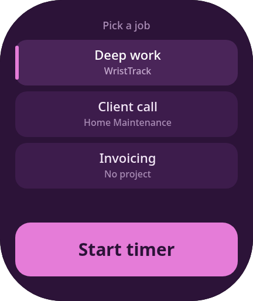

# WristTrack

A serverless Toggl Track timer for the Amazfit Bip Max. Start, stop and
re-label Toggl timers from your wrist.



The watch talks over Bluetooth to a Side Service inside the Zepp phone app, and
that Side Service talks straight to Toggl's API over HTTPS. There is no server
in between and no account to create beyond the Toggl one you already have.

## How it works

```text
Amazfit Bip Max device app
        |  ZML over Bluetooth
Zepp phone app Side Service  ──── shared settings storage ──── Zepp settings UI
        |
        |  HTTPS with your Toggl token
        v
Toggl Track API v9
```

Only the fields the watch needs to draw a screen cross Bluetooth — description,
project name, start time. **Your Toggl token never leaves the phone.**

The Side Service keeps the last known timer state in Zepp's settings storage
and answers the watch from it, so the watch and Toggl are not the same
question. See [Staying in sync](#staying-in-sync) for why that matters.

## What it does

- Shows whether a timer is running, with a live elapsed clock.
- Picks up timers started, stopped or re-labelled somewhere else — the Toggl
  phone app, the web app, the browser extension — usually within 15 seconds.
- Starts and stops timers against Toggl Track API v9.
- Offers your five most recent entries as one-tap presets, newest first.
- Re-labels a running timer in place: tap a job below the clock and the
  description and project change without resetting the elapsed time.
- Handles an empty account, a rejected token, an offline phone and Toggl's
  hourly API limit, with a readable message for each.
- No analytics, no ads, no developer-operated data collection.

## Why setup uses a personal token

Toggl Track publishes no OAuth authorization, token, PKCE or device-code
endpoints, so there is no way for a third-party app to be granted delegated
access. Toggl's own browser extension works the same way this does: it signs you
in on the web, then reads and stores your personal API token.

You copy that token from your Toggl profile into Zepp's settings once. It stays
on the phone, is never sent to the watch or to any server of ours, and you can
revoke it from Toggl at any time.

## Staying in sync

Stop a timer in the Toggl phone app and the watch should notice. It does, but
by asking rather than by being told, and Toggl's Free plan allows only **30 API
requests per hour per user** on a sliding window before it answers 402.

There is no push option available here. Toggl publishes no websocket or
streaming API for third parties, and its webhooks deliver to a public HTTPS
endpoint, which a phone does not have. Nor could the app hold a connection open
if one existed: a Zepp OS Side Service is given Messaging, Fetch and Settings
and nothing else — there is no `WebSocket` anywhere in the platform SDK — and
it does not run in the background. Every design here follows from that.

There are two caches, one on each side of the Bluetooth link. **The watch keeps
its own copy of the last screen it drew**, so opening the app draws that
immediately and then asks the phone; when the reply lands the screen is drawn
again from the updated copy. A launch shows the timer, not a spinner. Until the
reply arrives the screen is marked **Checking**, because a restored screen is
last night's news until something confirms it.

That copy can be days old, so what it may claim depends on its age. A saved
screen showing **nothing running** is drawn however old it is — it is a menu of
recent jobs, which is what somebody opening the app to start one wants, and it
asserts nothing that can be wrong. A saved screen showing a **running timer** is
only drawn if it is under an hour old. The elapsed clock is computed from the
start time, so it stays right for as long as the timer really is running; the
risk is the word *Running* itself, on an entry stopped from the phone on Monday.
Past that hour the spinner is the honest answer, and a watch clock that has
moved backwards counts as no evidence of freshness at all.

**Nothing runs in the background.** There is no `app-service` registered, so the
watch has no background process, and the Side Service only wakes when it is
asked. Polling exists only while the app is open, and stops two minutes after
the last thing you do — an app left in a pocket must not quietly spend the hour.

The Side Service holds the second cache, and meters what reaches Toggl:

- **Reads are served from cache.** A status check inside a 12-second window
  costs nothing. Opening the app twice in a minute is one request, not four.
- **The recent-jobs list has its own slow clock.** It is re-read every 30
  minutes rather than on every check, which is what keeps a routine poll to a
  single request — the one asking what is running.
- **Background checks may spend only 18 of the 30.** The remaining 12 are held
  back so start and stop still work at the end of a long session. A screen left
  open backs off from 15-second to 60-second checks as the hour fills, then
  stops and says **sync paused** rather than spending a request it cannot
  afford. `test/cache.test.js` drives an hour of that schedule and asserts the
  reserve survives.
- **Actions compute their own result.** Toggl has already confirmed a stop, so
  the finished job is moved to the top of the list locally instead of re-reading
  it. Stopping and re-labelling cost one request each, down from two and three;
  starting costs two, down from three.
- **The job list is cached whole.** Keeping the running job out of it is done on
  the way to the watch, not in the cache. Written back, that removal would be
  permanent: every job that ran would drop out of the list until the next
  recent-entries read, and re-labelling away from one would never offer it back.
- **Starting always asks Toggl anyway.** The one place the cache is deliberately
  not trusted. A timer begun on the phone seconds ago may not have been polled
  yet, and starting a second one over it corrupts the time log — which is worth
  more than the request it would save.

Measured against about thirty ten-second glances a day, which is the pattern
this is tuned for, that comes to **63 requests across the whole day**, and a
heavy hour of ten glances spends **12 of the 18** allowed. `test/side-service.test.js`
drives both of those against the real code.

Worth being precise about where the win is: a glance half an hour after the last
one finds every cache expired, so it costs the same two requests it always did.
What the cache buys is that a second look inside the same glance is free, that
actions cost less, and that clustered glances stop paying for the recent list
each time. The limit being reached degrades into stale-but-labelled data rather
than an error.

---

# Installing it

## Before you start

- Node.js LTS and this repository on your computer.
- The Zepp app on your phone, with your Amazfit Bip Max paired.
- A free Zepp developer account: <https://console.zepp.com/>.

```sh
npm install --global @zeppos/zeus-cli
./scripts/worktree-init.sh
zeus login          # once, with your Zepp developer account
```

The phone must be signed in to the **same Zepp account** as the CLI. `zeus
status` prints the account it holds.

## 1. Turn on Developer Mode in Zepp

1. Open Zepp and go to **Profile → Settings → About**.
2. Tap the Zepp logo seven times in a row, until a confirmation appears.
3. Go back to **Profile → Settings**. A new **Developer Mode** row is now in
   that list.
4. Open it. The screen holds a small set of tools: a **Scan** (QR) function, a
   screenshot button, real-machine logs, **Bridge** mode, and device
   information.

## 2. Install, either way

**QR code.** Build and publish a preview, then scan it:

```sh
npm run preview -- -t "Amazfit Bip Max"
```

Scan the printed code with the **Scan** function on the Developer Mode screen —
not your phone's camera app, which will only see a dead link. Each `zeus
preview` publishes a new package and prints a new code, so **regenerate it after
every change**; rescanning an old code reinstalls the old build.

**Developer bridge.** More reliable, and it reports real errors instead of the
phone's generic message. Enable **Bridge** on the Developer Mode screen, then:

```sh
zeus bridge
bridge$ connect
bridge$ install
```

`zeus bridge` builds from the directory you launch it in, so run it from the
project root. `install` compiles from source itself — there is no separate build
step. Bridge mode is not persistent; if `connect` reports *No connectable online
App or Simulator*, re-enable Bridge on the phone and keep that screen open.

Re-run `./scripts/worktree-init.sh` in any directory that has never been built
from — a fresh clone or a new git worktree, where `node_modules` is gitignored.
Skipping it builds a package that installs happily and then shows nothing but a
black screen; see *A black screen after install* below.

## 3. Connect your Toggl account

1. In Zepp, open **Profile → Amazfit Bip Max → App Settings → WristTrack**.
2. Tap **Open Toggl profile to get token →** and sign in if asked.
3. Copy the **API token** from the bottom of the Toggl profile page.
4. Paste it into **API token** and wait for **Signed in as …**.
5. Optionally set a default description, workspace and project. These are only
   used as a starting point when your account has no history yet.

## 4. Use it

Open **WristTrack** from the watch's app list.

- **Pick a job** — your recent entries as rows. Tap one to select it, then
  **Start timer**. More than three shows a `‹ 2 of 5 ›` pager.
- **Running** — the pink card shows the live clock. The jobs below it are
  one-tap switches: tapping one re-labels the running entry without resetting
  the clock. Tap the card itself for the full list.
- **Stop timer** closes the entry in Toggl.

Your phone must be paired and online at the moment you press start or stop.

---

# When something goes wrong

## On the watch

| What you see | What it means |
| --- | --- |
| **Connect Toggl** | No token saved yet. Finish step 3. |
| **Token rejected. Update it in Zepp settings.** | Toggl returned 401 or 403 — the token was mistyped or has been revoked. Paste it again. |
| **Toggl hourly API limit reached.** | Toggl returned 402. The free plan allows 30 requests per hour per user on a sliding window, plus a separate 30/hour per workspace. Normal use is nowhere near this. |
| **Sync paused · last known** | Not an error. The hour's background allowance is spent, so the phone is showing the last state it confirmed. Start and stop still work. See [Staying in sync](#staying-in-sync). |
| **Checking** | Not an error. The watch has drawn its saved screen and is waiting on the phone, normally for about a second. It clears itself. |
| **Toggl is rate limiting. Try again shortly.** | Toggl returned 429, its short-term burst limiter. Wait a moment. |
| **Toggl is having trouble. Try again shortly.** | A 5xx from Toggl. Not your fault. |
| **Phone is offline or Toggl is unavailable.** | The phone lost its data connection, or Bluetooth to the watch dropped. |
| **A timer is already running.** | Toggl already has a running entry. Refresh to pick it up. |
| **Phone link is still starting.** | The watch app opened before the phone connection was ready. Press the button again. |
| **Nothing tracked yet** | No entries in the last 30 days. Track something once, from Toggl or the watch. |

## "Send package to device failed"

The package reached the phone but not the watch. In order:

1. **Change the app ID.** This was the real cause here. `1000001` could not be
   installed at all, while nine otherwise-identical packages with other IDs
   installed fine. A low placeholder is either reserved or gets wedged on the
   watch by an earlier failed install, after which it blocks its own
   replacement. Bump `app.appId` and reinstall. The debugging lesson: the app ID
   is part of the package identity, so vary it too rather than only the
   contents.
2. **Wake the watch** and confirm Zepp shows it as connected.
3. **Wait out any sync.** Zepp's own docs name an occupied transfer channel as a
   common cause; a firmware update or data sync will block it.
4. **Check the API level.** Developer Mode → *Device information* shows it as a
   compact integer with a zero-padded minor: `404` means **4.4**, not 4.0.4.
   `runtime.apiVersion.minVersion` must be at or below that number.
5. **Free space** on the watch by removing other side-loaded apps.

## A black screen after install

The app installs, opens, and paints nothing at all — not even the background.
The build is missing `@zeppos/zml`. zeus does not treat an unresolvable
dependency as an error: it emits a runtime `__$$RQR$$__("@zeppos/zml/base-side")`
in place of the inlined library, so `BasePage` and `BaseSideService` are
undefined on the watch and both sides die before drawing. The usual cause is
building from a directory with no `node_modules` — a fresh clone, or a git
worktree, where it is gitignored.

Run `./scripts/worktree-init.sh` and install again. To confirm the diagnosis
from a package, unzip `dist/*.zab`, then its `.zpk`, then `app-side.zip`:
`app-side.js` should be around 30 KB with the library inlined. Eight KB with an
`__$$RQR$$__` require left in it is the broken build.

## Reading the logs

Zepp's Developer Mode has a **Mini Program icon** that opens a log screen with
**Device App** and **Side Service** tabs; the button at the bottom right starts
collecting. If a package never reaches the watch the Device App tab stays empty,
because the app never ran — for install failures only the Side Service tab can
have anything. These logs earn their keep after install.

`zeus bridge` also streams both sides, which is usually easier to read.

---

# Working on it

```sh
npm test              # unit tests plus layout checks
npm run screens       # regenerate docs/screens/ from the real page code
npm run build         # write a .zab into dist/
```

`test/toggl.test.js` covers the Toggl request layer. `test/cache.test.js` covers
the request budget and the local cache arithmetic. `test/side-service.test.js`
runs the real `app-side` code against a stubbed Toggl and asserts what each
action actually costs — that a repeat status read reaches Toggl zero times, a
due poll once, stop and re-label once each, and start twice. It also replays a
day of glances and a busy hour against the budget. `test/page.test.js` covers
the watch-side copy — that a launch draws it rather than the spinner, that a
three-day-old running timer is withheld while a three-day-old job list is not,
that a corrupt one falls back safely, and that polling stops when the app is
left alone. `test/layout.test.js` runs
the real `page/home` code against stubbed Zepp modules and asserts every screen
stays inside the panel, clears the rounded corners, and gives each button a
handler — it has already caught a button clipped by the corner radius that would
otherwise have shipped.

`node tools/check-toggl.mjs <token>` exercises the Toggl layer against the live
API: it reads your account and the running entry, and builds the same presets
the watch uses.

## The simulator

The official simulator is a Debian package. On an Arch-family host it needs a
compatibility shim, and on GNOME/Wayland QEMU only produces a readable
framebuffer with SDL software rendering. `tools/sim.sh` sets all of that up:

```sh
tools/sim.sh start          # or stop / restart / status
npm run dev -- -t "Amazfit Bip 6"
tools/shot.sh watch.png     # capture the emulated panel
```

The simulator catalog has no Bip Max image, so add a temporary `bip-6` target
(`"st": "s", "sr": "w390", "dw": 390`, plus `assets/bip-6.w390-s/icon.png`) to
work there. Give every target an explicit `sr` and `dw`: a target listing only
`{"st": "s"}` does **not** mean "any square watch" — zeus resolves it to one
particular device, which will not install on a Bip Max.

`tools/import-shot.sh <name>` files a screenshot taken with `bridge$ screenshot`
into `docs/screens/device/`, which holds real captures. The PNGs one level up
are rendered from the widget tree and cover states that are awkward to reproduce
on hardware.

## Screens

`docs/screens/` is regenerated by `npm run screens`, which runs the real page
module against stub Zepp modules and rasterises the resulting widget tree at
432×514. The current design was chosen from a gallery of ten directions, each
drawn from the same primitives Zepp OS actually provides.

## Before publishing

1. Create the app at <https://console.zepp.com/> and put the assigned numeric ID
   in `app.appId`. The current `1000011` is still a placeholder.
2. Set `app.vender` to your publisher name.
3. **Replace the icon.** It is currently Toggl's own brand mark, taken from
   their favicon. Toggl's media toolkit asks that their logo be used as-is and
   not in a way that implies endorsement or collaboration. That is fine for a
   personal side-loaded build; it is not fine for a store listing.
4. Put a real support address in `PRIVACY.md`, and review `STORE.md`.
5. `npm test && npm run build`, then test the `.zab` against invalid token, no
   timer, existing timer, offline phone, disconnected Bluetooth, and token
   deletion.
6. Upload from `dist/`, declare the `data:os.device.info` permission, and
   explain the personal-token setup in the review notes.

## Security limitations

- Zepp's settings storage is app-local storage, not a hardware-backed vault.
  The token never reaches the watch or a third party, but a compromised phone
  or Zepp app could expose it.
- Toggl API tokens are broad, long-lived credentials with no scopes.
- Disconnect in Zepp and rotate the token from Toggl after losing a phone.
- Do not put the token in a QR code. QR images are trivial to capture and a
  Toggl token is reusable.

## References

- Zepp OS quick start: <https://docs.zepp.com/docs/guides/quick-start/>
- Zepp device list: <https://docs.zepp.com/docs/reference/related-resources/device-list/>
- Toggl authentication: <https://engineering.toggl.com/docs/track/authentication/>
- Toggl time entries: <https://engineering.toggl.com/docs/track/api/time_entries/>
- Toggl API limits: <https://support.toggl.com/en-us/article/api-webhook-limits-85auc8/>
